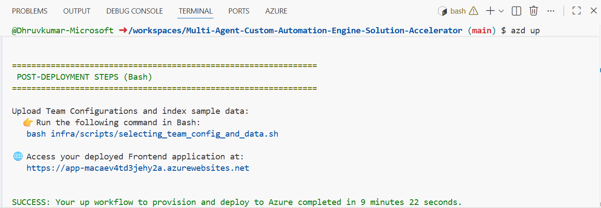
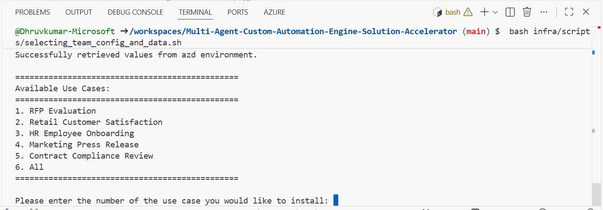

# Deployment Guide

## Overview

This guide walks you through deploying the Multi Agent Custom Automation Engine Solution Accelerator to Azure. The deployment process takes approximately 9-10 minutes for the default Development/Testing configuration and includes both infrastructure provisioning and application setup.

🆘 **Need Help?** If you encounter any issues during deployment, check our [Troubleshooting Guide](./TroubleShootingSteps.md) for solutions to common problems.

## Step 1: Prerequisites & Setup

### 1.1 Azure Account Requirements

Ensure you have access to an [Azure subscription](https://azure.microsoft.com/free/) with the following permissions:

| **Required Permission/Role** | **Scope** | **Purpose** |
|------------------------------|-----------|-------------|
| **Contributor** | Subscription level | Create and manage Azure resources |
| **User Access Administrator** | Subscription level | Manage user access and role assignments |
| **Role Based Access Control** | Subscription/Resource Group level | Configure RBAC permissions |
| **App Registration Creation** | Azure Active Directory | Create and configure authentication |

**🔍 How to Check Your Permissions:**

1. Go to [Azure Portal](https://portal.azure.com/)
2. Navigate to **Subscriptions** (search for "subscriptions" in the top search bar)
3. Click on your target subscription
4. In the left menu, click **Access control (IAM)**
5. Scroll down to see the table with your assigned roles - you should see:
   - **Contributor** 
   - **User Access Administrator**
   - **Role Based Access Control Administrator** (or similar RBAC role)

**For App Registration permissions:**
1. Go to **Microsoft Entra ID** → **Manage** → **App registrations**
2. Try clicking **New registration** 
3. If you can access this page, you have the required permissions
4. Cancel without creating an app registration

📖 **Detailed Setup:** Follow [Azure Account Set Up](./AzureAccountSetUp.md) for complete configuration.

### 1.2 Check Service Availability & Quota

⚠️ **CRITICAL:** Before proceeding, ensure your chosen region has all required services available:

**Required Azure Services:**
- [Azure AI Foundry](https://learn.microsoft.com/en-us/azure/ai-foundry/)
- [Azure OpenAI Service](https://learn.microsoft.com/en-us/azure/ai-services/openai/)
- [Azure AI Search](https://learn.microsoft.com/en-us/azure/search/)
- [Azure App Service](https://learn.microsoft.com/en-us/azure/app-service/)
- [Azure Container Apps](https://learn.microsoft.com/en-us/azure/container-apps/)
- [Azure Container Registry](https://learn.microsoft.com/en-us/azure/container-registry/)
- [Azure Cosmos DB](https://learn.microsoft.com/en-us/azure/cosmos-db/)
- [Azure Key Vault](https://learn.microsoft.com/en-us/azure/key-vault/)
- [Azure Blob Storage](https://learn.microsoft.com/en-us/azure/storage/blobs/)
- [Azure Queue Storage](https://learn.microsoft.com/en-us/azure/storage/queues/)
- [GPT Model Capacity](https://learn.microsoft.com/en-us/azure/ai-services/openai/concepts/models)

**Recommended Regions:** East US, East US2, Australia East, Japan East, UK South, France Central

🔍 **Check Availability:** Use [Azure Products by Region](https://azure.microsoft.com/en-us/explore/global-infrastructure/products-by-region/) to verify service availability.

### 1.3 Quota Check (Optional)

💡 **RECOMMENDED:** Check your Azure OpenAI quota availability before deployment for optimal planning.

📖 **Follow:** [Quota Check Instructions](./quota_check.md) to ensure sufficient capacity.

**Default Quota Configuration:**
- **GPT-4.1:** 150k tokens
- **o4-mini:** 50k tokens
- **GPT-4.1-mini:** 50k tokens

> **Note:** When you run `azd up`, the deployment will automatically show you regions with available quota, so this pre-check is optional but helpful for planning purposes. You can customize these settings later in [Step 3.3: Advanced Configuration](#33-advanced-configuration-optional).

📖 **Adjust Quota:** Follow [Azure AI Model Quota Settings](./AzureGPTQuotaSettings.md) if needed.

## Step 2: Choose Your Deployment Environment

Select one of the following options to deploy the Multi Agent Custom Automation Engine Solution Accelerator:

### Environment Comparison

| **Option** | **Best For** | **Prerequisites** | **Setup Time** |
|------------|--------------|-------------------|----------------|
| **GitHub Codespaces** | Quick deployment, no local setup required | GitHub account | ~3-5 minutes |
| **VS Code Dev Containers** | Fast deployment with local tools | Docker Desktop, VS Code | ~5-10 minutes |
| **VS Code Web** | Quick deployment, no local setup required | Azure account | ~2-4 minutes |
| **Local Environment** | Enterprise environments, full control | All tools individually | ~15-30 minutes |

**💡 Recommendation:** For fastest deployment, start with **GitHub Codespaces** - no local installation required.

---

<details>
<summary><b>Option A: GitHub Codespaces (Easiest)</b></summary>

[](https://codespaces.new/microsoft/Multi-Agent-Custom-Automation-Engine-Solution-Accelerator)

1. Click the badge above (may take several minutes to load)
2. Accept default values on the Codespaces creation page
3. Wait for the environment to initialize (includes all deployment tools)
4. Proceed to [Step 3: Configure Deployment Settings](#step-3-configure-deployment-settings)

</details>

<details>
<summary><b>Option B: VS Code Dev Containers</b></summary>

[](https://vscode.dev/redirect?url=vscode://ms-vscode-remote.remote-containers/cloneInVolume?url=https://github.com/microsoft/Multi-Agent-Custom-Automation-Engine-Solution-Accelerator)

**Prerequisites:**
- [Docker Desktop](https://www.docker.com/products/docker-desktop/) installed and running
- [VS Code](https://code.visualstudio.com/) with [Dev Containers extension](https://marketplace.visualstudio.com/items?itemName=ms-vscode-remote.remote-containers)

**Steps:**
1. Start Docker Desktop
2. Click the badge above to open in Dev Containers
3. Wait for the container to build and start (includes all deployment tools)
4. Proceed to [Step 3: Configure Deployment Settings](#step-3-configure-deployment-settings)

</details>

<details>
<summary><b>Option C: Visual Studio Code Web</b></summary>

[&message=Open&color=blue&logo=visualstudiocode&logoColor=white)](https://insiders.vscode.dev/azure/?vscode-azure-exp=foundry&agentPayload=eyJiYXNlVXJsIjogImh0dHBzOi8vcmF3LmdpdGh1YnVzZXJjb250ZW50LmNvbS9taWNyb3NvZnQvTXVsdGktQWdlbnQtQ3VzdG9tLUF1dG9tYXRpb24tRW5naW5lLVNvbHV0aW9uLUFjY2VsZXJhdG9yL3JlZnMvaGVhZHMvbWFpbi9pbmZyYS92c2NvZGVfd2ViIiwgImluZGV4VXJsIjogIi9pbmRleC5qc29uIiwgInZhcmlhYmxlcyI6IHsiYWdlbnRJZCI6ICIiLCAiY29ubmVjdGlvblN0cmluZyI6ICIiLCAidGhyZWFkSWQiOiAiIiwgInVzZXJNZXNzYWdlIjogIiIsICJwbGF5Z3JvdW5kTmFtZSI6ICIiLCAibG9jYXRpb24iOiAiIiwgInN1YnNjcmlwdGlvbklkIjogIiIsICJyZXNvdXJjZUlkIjogIiIsICJwcm9qZWN0UmVzb3VyY2VJZCI6ICIiLCAiZW5kcG9pbnQiOiAiIn0sICJjb2RlUm91dGUiOiBbImFpLXByb2plY3RzLXNkayIsICJweXRob24iLCAiZGVmYXVsdC1henVyZS1hdXRoIiwgImVuZHBvaW50Il19)

1. Click the badge above (may take a few minutes to load)
2. Sign in with your Azure account when prompted
3. Select the subscription where you want to deploy the solution
4. Wait for the environment to initialize (includes all deployment tools)
5. When prompted in the VS Code Web terminal, choose one of the available options shown below:

   
   
6. **Authenticate with Azure** (VS Code Web requires device code authentication):
   ```shell
   az login --use-device-code
   ```
   > **Note:** In VS Code Web environment, the regular `az login` command may fail. Use the `--use-device-code` flag to authenticate via device code flow. Follow the prompts in the terminal to complete authentication.

7. Proceed to [Step 3: Configure Deployment Settings](#step-3-configure-deployment-settings)

</details>

<details>
<summary><b>Option D: Local Environment</b></summary>

**Required Tools:**
- [PowerShell 7.0+](https://learn.microsoft.com/en-us/powershell/scripting/install/installing-powershell) 
- [Azure Developer CLI (azd) 1.18.0+](https://aka.ms/install-azd)
- [Python 3.9+](https://www.python.org/downloads/)
- [Docker Desktop](https://www.docker.com/products/docker-desktop/)
- [Git](https://git-scm.com/downloads)

**Setup Steps:**
1. Install all required deployment tools listed above
2. Clone the repository:

   ```shell
   azd init -t microsoft/Multi-Agent-Custom-Automation-Engine-Solution-Accelerator/
   ```
   > **⚠️ Warning:** The `azd init` command will download and initialize the project template. If you run this command in a directory that already contains project files, it may override your existing changes. Only run this command once when setting up the project for the first time. If you need to update an existing project, consider using `git pull` or manually downloading updates instead.

3. Open the project folder in your terminal
4. Proceed to [Step 3: Configure Deployment Settings](#step-3-configure-deployment-settings)

**PowerShell Users:** If you encounter script execution issues, run:
```powershell
Set-ExecutionPolicy -Scope Process -ExecutionPolicy Bypass
```

</details>

## Step 3: Configure Deployment Settings

Review the configuration options below. You can customize any settings that meet your needs, or leave them as defaults to proceed with a standard deployment.

### 3.1 Choose Deployment Type (Optional)

| **Aspect** | **Development/Testing (Default)** | **Production** |
|------------|-----------------------------------|----------------|
| **Configuration File** | `main.parameters.json` (sandbox) | Copy `main.waf.parameters.json` to `main.parameters.json` |
| **Security Controls** | Minimal (for rapid iteration) | Enhanced (production best practices) |
| **Cost** | Lower costs | Cost optimized |
| **Use Case** | POCs, development, testing | Production workloads |
| **Framework** | Basic configuration | [Well-Architected Framework](https://learn.microsoft.com/en-us/azure/well-architected/) |
| **Features** | Core functionality | Reliability, security, operational excellence |

**To use production configuration:**

**Prerequisite** — Enable the Microsoft.Compute/EncryptionAtHost feature for every subscription (and region, if required) where you plan to deploy VMs or VM scale sets with `encryptionAtHost: true`. Repeat the registration steps below for each target subscription (and for each region when applicable). This step is required for **WAF-aligned** (production) deployments.

Steps to enable the feature:

1. Set the target subscription:
   Run: <code>az account set --subscription "&lt;YourSubscriptionId&gt;"</code>
2. Register the feature (one time per subscription):
   Run: <code>az feature register --name EncryptionAtHost --namespace Microsoft.Compute</code>
3. Wait until registration completes and shows "Registered":
   Run: <code>az feature show --name EncryptionAtHost --namespace Microsoft.Compute --query properties.state -o tsv</code>
4. Refresh the provider (if required):
   Run: <code>az provider register --namespace Microsoft.Compute</code>
5. Re-run the deployment after registration is complete.

Note: Feature registration can take several minutes. Ensure the feature is registered before attempting deployments that require encryptionAtHost.

Reference: Azure Host Encryption — https://learn.microsoft.com/azure/virtual-machines/disks-enable-host-based-encryption-portal?tabs=azure-cli

Copy the contents from the production configuration file to your main parameters file:

1. Navigate to the `infra` folder in your project
2. Open `main.waf.parameters.json` in a text editor (like Notepad, VS Code, etc.)
3. Select all content (Ctrl+A) and copy it (Ctrl+C)
4. Open `main.parameters.json` in the same text editor
5. Select all existing content (Ctrl+A) and paste the copied content (Ctrl+V)
6. Save the file (Ctrl+S)

### 3.2 Set VM Credentials (Optional - Production Deployment Only)

> **Note:** This section only applies if you selected **Production** deployment type in section 3.1. VMs are not deployed in the default Development/Testing configuration.

By default, random GUIDs are generated for VM credentials. To set custom credentials:

```shell
azd env set AZURE_ENV_VM_ADMIN_USERNAME <your-username>
azd env set AZURE_ENV_VM_ADMIN_PASSWORD <your-password>
```

### 3.3 Advanced Configuration (Optional)

<details>
<summary><b>Configurable Parameters</b></summary>

You can customize various deployment settings before running `azd up`, including Azure regions, AI model configurations (deployment type, version, capacity), container registry settings, and resource names.

📖 **Complete Guide:** See [Parameter Customization Guide](./CustomizingAzdParameters.md) for the full list of available parameters and their usage.

</details>

<details>
  <summary><b>[Optional] Quota Recommendations</b></summary>

By default, the **GPT model capacity** in deployment is set to **150k tokens**.

To adjust quota settings, follow these [steps](./AzureGPTQuotaSettings.md).

**⚠️ Warning:** Insufficient quota can cause deployment errors. Please ensure you have the recommended capacity or request additional capacity before deploying this solution.

</details>

<details>
<summary><b>Reuse Existing Resources</b></summary>

To optimize costs and integrate with your existing Azure infrastructure, you can configure the solution to reuse compatible resources already deployed in your subscription.

**Supported Resources for Reuse:**

- **Log Analytics Workspace:** Integrate with your existing monitoring infrastructure by reusing an established Log Analytics workspace for centralized logging and monitoring. [Configuration Guide](./re-use-log-analytics.md)

- **Azure AI Foundry Project:** Leverage your existing AI Foundry project and deployed models to avoid duplication and reduce provisioning time. [Configuration Guide](./re-use-foundry-project.md)

**Key Benefits:**
- **Cost Optimization:** Eliminate duplicate resource charges
- **Operational Consistency:** Maintain unified monitoring and AI infrastructure
- **Faster Deployment:** Skip resource creation for existing compatible services
- **Simplified Management:** Reduce the number of resources to manage and monitor

**Important Considerations:**
- Ensure existing resources meet the solution's requirements and are in compatible regions
- Review access permissions and configurations before reusing resources
- Consider the impact on existing workloads when sharing resources

</details>

## Step 4: Deploy the Solution

💡 **Before You Start:** If you encounter any issues during deployment, check our [Troubleshooting Guide](./TroubleShootingSteps.md) for common solutions.

⚠️ **Critical: Redeployment Warning** - If you have previously run `azd up` in this folder (i.e., a `.azure` folder exists), you must [create a fresh environment](#creating-a-new-environment) to avoid conflicts and deployment failures.

### 4.1 Authenticate with Azure

```shell
azd auth login
```

> **Note for VS Code Web Users:** If you're using VS Code Web and have already authenticated using `az login --use-device-code` in Option C, you may skip this step or proceed with `azd auth login` if prompted.

**For specific tenants:**
```shell
azd auth login --tenant-id <tenant-id>
```

**Finding Tenant ID:**
1. Open the [Azure Portal](https://portal.azure.com/)
2. Navigate to **Microsoft Entra ID** from the left-hand menu
3. Under the **Overview** section, locate the **Tenant ID** field. Copy the value displayed

### 4.2 Start Deployment

```shell
azd up
```

**During deployment, you'll be prompted for:**
1. **Environment name** (e.g., "macaedev") - Must be 3-16 characters long, alphanumeric only
2. **Azure subscription** selection
3. **Azure AI Foundry deployment region** - Select a region with available model quota for AI operations
4. **Primary location** - Select the region where your infrastructure resources will be deployed
5. **Resource group** selection (create new or use existing)

**Expected Duration:** 9-10 minutes for default configuration

- **Upon successful completion**, you will see a success message indicating that all resources have been deployed, along with the application URL and next steps for uploading team configurations and sample data.



**⚠️ Deployment Issues:** If you encounter errors or timeouts, try a different region as there may be capacity constraints. For detailed error solutions, see our [Troubleshooting Guide](./TroubleShootingSteps.md).

### 4.3 Get Application URL

After successful deployment:
1. Open [Azure Portal](https://portal.azure.com/)
2. Navigate to your resource group
3. Find the Frontend App Service
4. Copy the **Default domain**

⚠️ **Important:** Complete [Post-Deployment Steps](#step-5-post-deployment-configuration) before accessing the application.

## Step 5: Post-Deployment Configuration

### 5.1 Run Post Deployment Script

1. You can upload Team Configurations using command printed in the terminal. The command will look like one of the following. Run the appropriate command for your shell from the project root:

  - **For Bash (Linux/macOS/WSL):**
    ```bash
    bash infra/scripts/selecting_team_config_and_data.sh
    ```

  - **For PowerShell (Windows):**
    ```powershell
    infra\scripts\Selecting-Team-Config-And-Data.ps1
    ```


2. After executing the above script, the system will present available use case scenarios for selection. You can choose individual scenarios or deploy all use cases simultaneously. Upon selection, the corresponding datasets and configuration files for the chosen use case(s) will be uploaded to your Azure environment.




### 5.2 Configure Authentication (Optional)

1. Follow [App Authentication Configuration](./azure_app_service_auth_setup.md)
2. Wait up to 10 minutes for authentication changes to take effect

### 5.3 Verify Deployment

1. Access your application using the URL from Step 4.3
2. Confirm the application loads successfully
<!-- 3. Verify you can sign in with your authenticated account -->

### 5.4 Test the Application

**Quick Test Steps:**

1. **Access the application** using the URL from Step 4.3
2. **Sign in** with your authenticated account
3. **Select a use case** from the available scenarios you uploaded in Step 5.1
4. **Ask a sample question** relevant to the selected use case
5. **Verify the response** includes appropriate multi-agent collaboration
6. **Check the logs** in Azure Portal to confirm backend processing

📖 **Detailed Instructions:** See the complete [Sample Workflow](./SampleQuestions.md) guide for step-by-step testing procedures and sample questions for each use case.


## Step 6: Clean Up (Optional)

### Remove All Resources

To purge resources and clean up after deployment, use the `azd down` command or follow the Delete Resource Group Guide for manual cleanup through Azure Portal.

```shell
azd down
```
> **Note:** If you deployed with `enableRedundancy=true` and Log Analytics workspace replication is enabled, you must first disable replication before running `azd down` else resource group delete will fail. Follow the steps in [Handling Log Analytics Workspace Deletion with Replication Enabled](./LogAnalyticsReplicationDisable.md), wait until replication returns `false`, then run `azd down`.

### Manual Cleanup (if needed)
If deployment fails or you need to clean up manually:
- Follow [Delete Resource Group Guide](./DeleteResourceGroup.md)

## Managing Multiple Environments

### Recover from Failed Deployment

If your deployment failed or encountered errors, here are the steps to recover:

<details>
<summary><b>Recover from Failed Deployment</b></summary>

**If your deployment failed or encountered errors:**

1. **Try a different region:** Create a new environment and select a different Azure region during deployment
2. **Clean up and retry:** Use `azd down` to remove failed resources, then `azd up` to redeploy
3. **Check troubleshooting:** Review [Troubleshooting Guide](./TroubleShootingSteps.md) for specific error solutions
4. **Fresh start:** Create a completely new environment with a different name

**Example Recovery Workflow:**
```shell
# Remove failed deployment (optional)
azd down

# Create new environment (3-16 chars, alphanumeric only)
azd env new macaeretry

# Deploy with different settings/region
azd up
```

</details>

### Creating a New Environment

If you need to deploy to a different region, test different configurations, or create additional environments:

<details>
<summary><b>Create a New Environment</b></summary>

**Create Environment Explicitly:**
```shell
# Create a new named environment (3-16 characters, alphanumeric only)
azd env new <new-environment-name>

# Select the new environment
azd env select <new-environment-name>

# Deploy to the new environment
azd up
```

**Example:**
```shell
# Create a new environment for production (valid: 3-16 chars)
azd env new macaeprod

# Switch to the new environment
azd env select macaeprod

# Deploy with fresh settings
azd up
```

> **Environment Name Requirements:**
> - **Length:** 3-16 characters
> - **Characters:** Alphanumeric only (letters and numbers)
> - **Valid examples:** `macae`, `test123`, `myappdev`, `prod2025`
> - **Invalid examples:** `co` (too short), `my-very-long-environment-name` (too long), `test_env` (underscore not allowed)

</details>

<details>
<summary><b>Switch Between Environments</b></summary>

**List Available Environments:**
```shell
azd env list
```

**Switch to Different Environment:**
```shell
azd env select <environment-name>
```

**View Current Environment:**
```shell
azd env get-values
```

</details>

### Best Practices for Multiple Environments

- **Use descriptive names:** `macaedev`, `macaeprod`, `macaetest` (remember: 3-16 chars, alphanumeric only)
- **Different regions:** Deploy to multiple regions for testing quota availability
- **Separate configurations:** Each environment can have different parameter settings
- **Clean up unused environments:** Use `azd down` to remove environments you no longer need

## Next Steps

Now that your deployment is complete and tested, explore these resources to enhance your experience:

📚 **Learn More:**
- [Local Development Setup](./LocalDevelopmentSetup.md) - Set up your local development environment
- [Sample Questions](./SampleQuestions.md) - Explore sample questions and workflows
- [MCP Server Documentation](./mcp_server.md) - Learn about Model Context Protocol server integration
- [Customizing Parameters](./CustomizingAzdParameters.md) - Advanced configuration options
- [Azure Account Setup](./AzureAccountSetUp.md) - Detailed Azure subscription configuration

## Need Help?

- 🐛 **Issues:** Check [Troubleshooting Guide](./TroubleShootingSteps.md)
- 💬 **Support:** Review [Support Guidelines](../SUPPORT.md)
- 🔧 **Development:** See [Contributing Guide](../CONTRIBUTING.md)

## Advanced: Deploy Local Changes

If you've made local modifications to the code and want to deploy them to Azure, follow these steps to swap the configuration files:

> **Note:** To set up and run the application locally for development, see the [Local Development Setup Guide](./LocalDevelopmentSetup.md).

### Step 1: Rename Azure Configuration Files

**In the root directory:**
1. Rename `azure.yaml` to `azure_custom2.yaml`
2. Rename `azure_custom.yaml` to `azure.yaml`

### Step 2: Rename Infrastructure Files

**In the `infra` directory:**
1. Rename `main.bicep` to `main_custom2.bicep`
2. Rename `main_custom.bicep` to `main.bicep`

### Step 3: Deploy Changes

Run the deployment command:
```shell
azd up
```

> **Note:** These custom files are configured to deploy your local code changes instead of pulling from the GitHub repository.