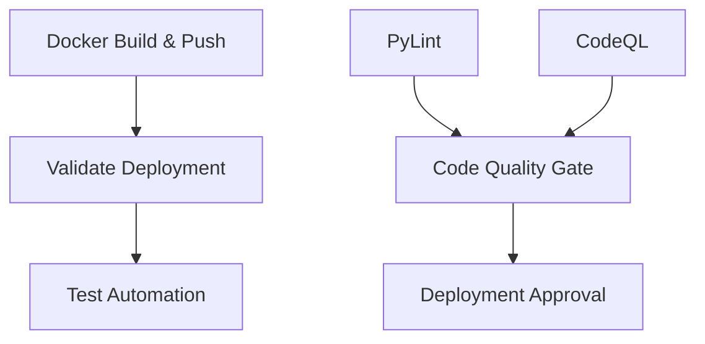

# GitHub Actions Workflows Documentation

This document provides a comprehensive guide to all GitHub Actions workflows in this repository, including when they run, what triggers them, and their specific purposes.

## Overview

The repository uses path-based triggers to ensure workflows only run when relevant files are modified, optimizing CI/CD performance and providing clearer PR feedback.

## Workflow Summary Table

| Workflow | Triggers | Purpose | Files Monitored |
|----------|----------|---------|-----------------|
| **Docker Build & Push** | Push/PR + Paths | Build and push Docker images for frontend, backend, and MCP server | `src/frontend/`, `src/backend/`, `src/mcp_server/` only |
| **PyLint** | Push/PR + Paths | Python code linting and quality checks (backend only) | `src/backend/` Python files, requirements.txt, .flake8 config |
| **CodeQL** | Push/PR + Paths + Schedule | Security and code quality analysis | Source code files only (Python, JS, TS, TSX), test Python files |
| **Test Workflow with Coverage** | Push/PR + Paths | Python unit tests with coverage reporting (backend-focused) | Backend, MCP, tests Python files, backend requirements |
| **Test Automation** | Push/PR + Paths + Manual | Run automated tests | Python files, test files, requirements |
| **Validate Deployment** | Push/PR + Paths + Schedule + Manual | Infrastructure validation and deployment | Main Bicep template, modules, parameters, infra scripts only |
| **Broken Link Checker** | PR + Paths + Manual | Check documentation links | Markdown files |

---

## Detailed Workflow Documentation

### 1. Docker Build and Push (`docker-build-and-push.yml`)

**Purpose**: Builds and optionally pushes Docker images for the three main components of the application.

**When it runs**:
- **Push** to branches: `main`, `dev-v3`, `demo-v3`, `hotfix`
- **Pull Requests** targeting these branches
- **Manual trigger** (`workflow_dispatch`)

**Path Filters** - Only runs when these files change:
```yaml
- 'src/frontend/**'          # Frontend React application
- 'src/backend/**'           # Python backend API
- 'src/mcp_server/**'        # MCP (Model Context Protocol) server
- '.github/workflows/docker-build-and-push.yml'  # This workflow file
```

**What it does**:
1. Builds three Docker images: `macaebackend`, `macaefrontend`, `macaemcp`
2. Pushes images to Azure Container Registry (ACR) when on protected branches
3. Tags images with branch-specific tags and historical tags
4. Skips push for pull requests (build-only validation)

### 2. Python Linting (`pylint.yml`)

**Purpose**: Ensures Python code quality and adherence to coding standards using Flake8.

**When it runs**:
- **Push** to any branch
- **Pull Requests** to any branch

**Path Filters** - Only runs when these files change:
```yaml
- 'src/backend/**/*.py'      # Backend Python files (only files actually linted)
- 'src/backend/requirements.txt'     # Backend dependencies (only file actually installed)
- '.flake8'                  # Flake8 configuration (only config file actually used)
- '.github/workflows/pylint.yml'     # This workflow file
```

**What it does**:
1. Sets up Python 3.11 environment
2. Installs dependencies from backend requirements
3. Runs Flake8 linting on the backend code

### 3. CodeQL Code Scanning (`codeql.yml`)

**Purpose**: Performs security and code quality analysis using GitHub's CodeQL engine.

**When it runs**:
- **Push** to branches: `main`, `dev`, `demo`
- **Pull Requests** targeting these branches
- **Scheduled** runs: Every Tuesday at 8:44 PM UTC

**Path Filters** - Only runs when these files change:
```yaml
- 'src/**/*.py'              # All Python source code files
- 'src/**/*.js'              # All JavaScript source code files
- 'src/**/*.ts'              # All TypeScript source code files
- 'src/**/*.tsx'             # All TypeScript JSX source code files
- 'tests/**/*.py'            # Python test files only (no .jsx files exist)
- '.github/workflows/codeql.yml'     # This workflow file
```

**What it does**:
1. Analyzes JavaScript/TypeScript and Python code
2. Identifies security vulnerabilities and code quality issues
3. Creates alerts for any findings
4. Runs automatically on schedule for continuous monitoring

### 4. Test Workflow with Coverage (`test.yml`)

**Purpose**: Runs Python unit tests with coverage reporting for code quality assurance (backend-focused).

**When it runs**:
- **Push** to branches: `main`, `dev`, `demo`, `hotfix`
- **Pull Requests** targeting these branches

**Path Filters** - Only runs when these files change:
```yaml
- 'src/backend/**/*.py'      # Backend Python files (actually tested)
- 'src/tests/**/*.py'        # Source test files (actually tested)
- 'src/mcp_server/**/*.py'   # MCP server Python files (actually tested)
- 'pytest.ini'               # Pytest configuration
- 'conftest.py'              # Pytest configuration
- 'src/backend/requirements.txt'     # Backend requirements (actually installed)
- 'pyproject.toml'           # Python project configuration
- '.github/workflows/test.yml'       # This workflow file
```

**What it does**:
1. Sets up Python environment
2. Installs dependencies from requirements files
3. Runs unit tests with pytest
4. Generates code coverage reports
5. Validates code quality metrics

### 5. Test Automation (`test-automation.yml`)

**Purpose**: Runs automated end-to-end tests against deployed instances.

**When it runs**:
- **Push** to any branch
- **Pull Requests** to any branch
- **Manual trigger** (`workflow_dispatch`)
- **Called by other workflows** (`workflow_call`)

**Path Filters** - Only runs when these files change:
```yaml
- 'src/**/*.py'              # All Python source files
- 'tests/**'                 # All test files
- 'src/tests/**'             # Source test files
- 'pytest.ini'               # Pytest configuration
- 'conftest.py'              # Pytest configuration
- 'requirements*.txt'        # Any requirements files
- 'src/backend/requirements*.txt'    # Backend requirements
- 'src/mcp_server/requirements*.txt' # MCP server requirements
- '.github/workflows/test-automation.yml' # This workflow file
```

**What it does**:
1. Sets up Python 3.13 environment
2. Authenticates with Azure
3. Runs automated tests against deployed MACAE instances
4. Can be configured with various test parameters

### 6. Validate Deployment (`deploy.yml`)

**Purpose**: Validates Azure infrastructure and performs deployments.

**When it runs**:
- **Push** to branches: `main`, `dev-v3`, `hotfix`
- **Pull Requests** targeting these branches
- **After successful Docker builds** (`workflow_run`)
- **Scheduled** runs: Daily at 11:00 AM and 11:00 PM GMT
- **Manual trigger** (`workflow_dispatch`)

**Path Filters** - Only runs when these files change:
```yaml
- 'infra/main.bicep'         # Main Bicep template (actually used)
- 'infra/modules/**/*.bicep' # Bicep module files (actually used)
- 'infra/*.parameters.json'  # Parameter files (actually used)
- 'infra/scripts/**'         # Infrastructure scripts (actually used)
- '.github/workflows/deploy.yml'    # This workflow file
```

**What it does**:
1. Checks Azure quota requirements
2. Creates or validates resource groups
3. Deploys Bicep templates to Azure
4. Configures deployed resources
5. Runs end-to-end tests
6. Cleans up resources if configured

### 7. Broken Link Checker (`broken-links-checker.yml`)

**Purpose**: Validates links in documentation files.

**When it runs**:
- **Pull Requests** (any branch)
- **Manual trigger** (`workflow_dispatch`)

**Path Filters** - Only runs when these files change:
```yaml
- '**/*.md'                  # All Markdown files
```

**What it does**:
1. Scans all Markdown files for links
2. Validates that links are accessible
3. Reports any broken links found

---

## Workflow Dependencies



### Dependency Chain:
1. **Code Quality Checks** (PyLint, CodeQL) run independently
2. **Docker Build & Push** must complete successfully
3. **Validate Deployment** triggers after successful Docker builds
4. **Test Automation** runs as part of deployment validation

---

## Branch-Specific Behavior

### Protected Branches (`main`, `dev-v3`, `demo-v3`, `hotfix`)
- Docker images are **pushed** to ACR
- Full deployment validation occurs
- Scheduled workflows run
- All quality gates must pass

### Feature Branches
- Docker images are **built only** (not pushed)
- Deployment validation skipped
- Code quality checks still run
- Faster feedback loop for development

### Pull Requests
- All path-filtered workflows run for validation
- No deployment or image pushing occurs
- Provides comprehensive validation before merge

---

## Path Filter Benefits

### Performance Optimization
- **Reduced CI/CD time**: Only relevant workflows run
- **Lower resource usage**: No unnecessary job executions
- **Faster feedback**: Developers get quicker PR status updates
- **Optimized triggers**: Paths are precisely matched to what each workflow actually uses

### Clearer PR Status
- PR checks only show relevant pipeline results
- Easier to identify which changes need attention
- Reduced noise from unrelated workflow failures

### Recent Optimizations (December 2025)
All workflow path filters have been optimized to only include files that are actually used by each workflow:

- **Docker Build & Push**: Removed unused Dockerfile patterns, requirements files, and lock files not in source directories
- **PyLint**: Streamlined to only backend Python files, specific requirements.txt, and .flake8 config (workflow only lints backend)
- **CodeQL**: Removed non-existent .jsx files, focused on actual source code files
- **Test Workflow**: Aligned with backend-focused testing approach, removed unused requirements patterns  
- **Validate Deployment**: Removed unused custom templates and Azure config files not referenced by workflow

**Result**: Significantly reduced false triggers from files like `.env.sample`, documentation changes, or configuration files that don't affect specific workflows.

### Examples of Path-Based Triggering

| Change Type | Workflows That Run |
|-------------|-------------------|
| Update React component in `src/frontend/` | Docker Build & Push, CodeQL |
| Modify Python API in `src/backend/` | Docker Build & Push, PyLint, CodeQL, Test with Coverage |
| Update MCP server in `src/mcp_server/` | Docker Build & Push, CodeQL, Test with Coverage |
| Update main Bicep template in `infra/main.bicep` | Validate Deployment |
| Update `.flake8` configuration | PyLint |
| Edit `.env.sample` files | **No workflows run** (optimized out) |
| Update documentation in `docs/` | Broken Link Checker (if .md files) |
| Update GitHub workflow file | The specific workflow + any dependent workflows |

---

## Manual Workflow Triggers

All workflows support manual triggering through the GitHub Actions UI:

1. Go to **Actions** tab in GitHub
2. Select the desired workflow
3. Click **Run workflow**
4. Choose branch and provide any required inputs

### Workflows with Additional Inputs
- **Validate Deployment**: Various Azure configuration options
- **Test Automation**: Test parameters and environment settings

---

## Troubleshooting

### Workflow Not Running When Expected
1. **Check path filters**: Ensure your changes match the path patterns
2. **Verify branch targeting**: Some workflows only run on specific branches
3. **Review workflow file**: Check for syntax errors in YAML

### All Workflows Running Despite Path Filters
- Workflows always run when their own file (`.yml`) is modified
- Changes to root-level configuration files may trigger multiple workflows
- Manual triggers bypass path filtering

### Performance Issues
- Path filters are working correctly if you see fewer workflow runs
- Check workflow run history to verify optimal triggering
- Contact maintainers if you notice performance degradation

---

## Maintenance

### Adding New Path Filters
1. Identify which files should trigger the workflow
2. Update the `paths:` section in the workflow YAML
3. Test with a sample PR to verify correct behavior
4. Update this documentation

### Modifying Existing Filters
1. Consider impact on existing development workflows
2. Test changes in a feature branch first
3. Update documentation to reflect changes
4. Communicate changes to the development team

For questions or issues with GitHub Actions workflows, please refer to the [troubleshooting guide](TroubleShootingSteps.md) or create an issue in this repository.