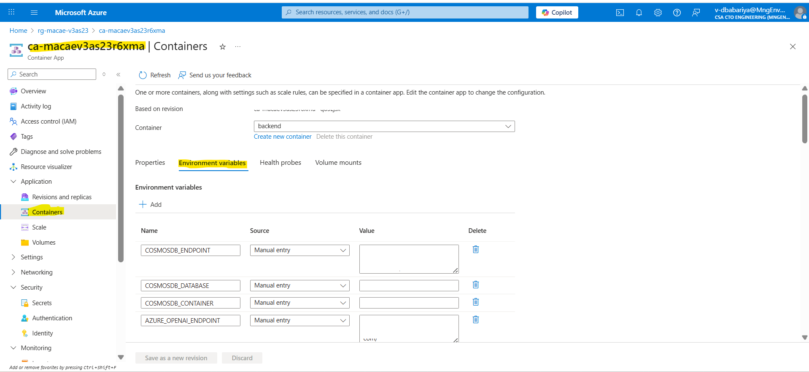

# Local Development Setup Guide

This guide provides comprehensive instructions for setting up the Multi Agent Custom Automation Engine Solution Accelerator for local development across Windows and Linux platforms.

## Important Setup Notes

### Multi-Service Architecture

This application consists of **three separate services** that run independently:

1. **Backend** - Backend APIs related to orchestration and Teams
2. **Frontend** - React-based user interface
3. **MCP Server** - MCP server to tools call

> **⚠️ Critical: Each service must run in its own terminal/console window**
>
> - **Do NOT close terminals** while services are running
> - Open **3 separate terminal windows** for local development
> - Each service will occupy its terminal and show live logs
>
> **Terminal Organization:**
> - **Terminal 1**: Backend - HTTP server on port 8000
> - **Terminal 2**: Frontend - Development server on port 3000
> - **Terminal 3**: MCP server - HTTP streamable server on port 9000

### Path Conventions

**All paths in this guide are relative to the repository root directory:**

```bash
Multi-Agent-Custom-Automation-Engine-Solution-Accelerator/    ← Repository root (start here)
├── src/
│   ├── backend/                            ← cd src/backend
│   │   ├── .venv/                          ← Virtual environment
│   │   └── .env                            ← Backend config file
│   │   └── app.py                          ← Backend Entry Point
│   ├── frontend/                           ← cd src/frontend
│   │   ├── node_modules/                   ← npm dependencies
│   │   ├── .venv/                          ← Virtual environment
│   │   ├── frontend_server.py              ← Frontend entry point
│   ├── mcp_server/                         ← cd src/mcp_server
│   │   ├── .venv/                          ← Virtual environment
│   │   └── mcp_server.py                   ← MCP server Entry Point
└── docs/                                   ← Documentation (you are here)
```

**Before starting any step, ensure you are in the repository root directory:**

```bash
# Verify you're in the correct location
pwd  # Linux/macOS - should show: .../Multi-Agent-Custom-Automation-Engine-Solution-Accelerator
Get-Location  # Windows PowerShell - should show: ...\Multi-Agent-Custom-Automation-Engine-Solution-Accelerator

# If not, navigate to repository root
cd path/to/Multi-Agent-Custom-Automation-Engine-Solution-Accelerator
```

### Configuration Files

This project uses Backend `.env` file in Backend directory with different configuration requirements:

- **Backend**: `src/backend/.env` 
<!-- - **Frontend**: `src/frontend.env` 
- **MCP Server**: `src/mcp_sevrer/.env`  -->


## Step 1: Prerequisites - Install Required Tools

### Windows Development

#### Option 1: Native Windows (PowerShell)

```powershell
# Install Python 3.12+ and Git
winget install Python.Python.3.12
winget install Git.Git

# Install Node.js for frontend
winget install OpenJS.NodeJS.LTS

# Install uv package manager
py -3.12 -m pip install uv
```

#### Option 2: Windows with WSL2 (Recommended)

```bash
# Install WSL2 first (run in PowerShell as Administrator):
# wsl --install -d Ubuntu

# Then in WSL2 Ubuntu terminal:
sudo apt update && sudo apt install python3.12 python3.12-venv git curl nodejs npm -y

# Install uv
curl -LsSf https://astral.sh/uv/install.sh | sh
source ~/.bashrc
```

### Linux Development

#### Ubuntu/Debian

```bash
# Install prerequisites
sudo apt update && sudo apt install python3.12 python3.12-venv git curl nodejs npm -y

# Install uv package manager
curl -LsSf https://astral.sh/uv/install.sh | sh
source ~/.bashrc
```

#### RHEL/CentOS/Fedora

```bash
# Install prerequisites
sudo dnf install python3.12 python3.12-devel git curl gcc nodejs npm -y

# Install uv
curl -LsSf https://astral.sh/uv/install.sh | sh
source ~/.bashrc
```

### Clone the Repository

```bash
git clone https://github.com/microsoft/Multi-Agent-Custom-Automation-Engine-Solution-Accelerator.git
cd Multi-Agent-Custom-Automation-Engine-Solution-Accelerator
```

## Step 2: Development Tools Setup

### Visual Studio Code (Recommended)

#### Required Extensions

Create `.vscode/extensions.json` in the workspace root and copy the following JSON:

```json
{
    "recommendations": [
        "ms-python.python",
        "ms-python.pylint",
        "ms-python.black-formatter",
        "ms-python.isort",
        "ms-vscode-remote.remote-wsl",
        "ms-vscode-remote.remote-containers",
        "redhat.vscode-yaml",
        "ms-vscode.azure-account",
        "ms-python.mypy-type-checker"
    ]
}
```

VS Code will prompt you to install these recommended extensions when you open the workspace.

#### Settings Configuration

Create `.vscode/settings.json` and copy the following JSON:

```json
{
    "python.defaultInterpreterPath": "${workspaceFolder}/src/backend/.venv/Scripts/python.exe",
    "python.terminal.activateEnvironment": true,
    "python.linting.enabled": true,
    "python.linting.pylintEnabled": false,
    "python.linting.flake8Enabled": true,
    "python.formatting.provider": "black",
    "python.debugging.logLevel": "Debug",
    "debug.terminal.clearBeforeReusing": true,
    "debug.onTaskErrors": "showErrors",
    "debug.showBreakpointsInOverviewRuler": true,
    "debug.inlineValues": "on",
    "files.exclude": {
        "**/__pycache__": true,
        "**/*.pyc": true
    },
    "python.analysis.extraPaths": [
        "${workspaceFolder}/src/backend",
        "${workspaceFolder}/src/mcp_server"
    ],
    "folders": [
        {
            "name": "Backend",
            "path": "./src/backend"
        },
        {
            "name": "MCP Server", 
            "path": "./src/mcp_server"
        },
        {
            "name": "Frontend",
            "path": "./src/frontend"
        }
    ]
}
```

## Step 3: Azure Authentication Setup

Before configuring services, authenticate with Azure:

```bash
# Login to Azure CLI
az login

# Set your subscription
az account set --subscription "your-subscription-id"

# Verify authentication
az account show
```


### Required Azure RBAC Permissions

To run the application locally, your Azure account needs the following role assignments on the deployed resources:

The **main.bicep** deployment includes the assignment of the appropriate roles to AOAI, Storage account, Search service and Cosmos services. If you want to use resource group which is not deployed by you for local debugging—you will need to add your own credentials to access the Cosmos Storage account, Search service and AOAI services. You can add these permissions using the following commands:

#### Get Your AAD User Object ID (Principal ID)

Your Azure AD User Object ID (also called Principal ID) is required for the role assignments below. Choose either method to obtain it:

**Method 1: Using Azure CLI (Recommended)**
```bash
az ad signed-in-user show --query id -o tsv
```

**Method 2: Using Azure Portal**
1. Go to [Azure Portal](https://portal.azure.com)
2. Open **Microsoft Entra ID** (or search "Entra")
3. In the left menu, select **Users**
4. Select your account
5. Under **Identity**, copy the **Object ID**

> **Note:** The `<aad-user-object-id>` and `<principal-id>` in the commands below refer to the same ID obtained from either method above.

#### Get Your AAD User Principal Name (UPN)

Your Azure AD User Principal Name (UPN) is your sign-in email address and is required for some role assignments. Choose either method to obtain it:

**Method 1: Using Azure CLI (Recommended)**
```bash
az ad signed-in-user show --query userPrincipalName -o tsv
```

**Method 2: Using Azure Portal**
1. Go to [Azure Portal](https://portal.azure.com)
2. Open **Microsoft Entra ID** (or search "Entra")
3. In the left menu, select **Users**
4. Select your account
5. Copy the **User principal name** (typically your email address, e.g., user@domain.com)

> **Note:** The `<aad-user-upn>` in the commands below refers to your User Principal Name obtained from either method above.

#### Cosmos DB Access

```bash
# Assign Cosmos DB Built-in Data Contributor role
az cosmosdb sql role assignment create --resource-group <solution-accelerator-rg> --account-name <cosmos-db-account-name> --role-definition-name "Cosmos DB Built-in Data Contributor" --principal-id <aad-user-object-id> --scope /subscriptions/<subscription-id>/resourceGroups/<solution-accelerator-rg>/providers/Microsoft.DocumentDB/databaseAccounts/<cosmos-db-account-name>
```

#### AI Foundry Access

**To get your AI Foundry Project Resource ID:**
1. Go to [Azure Portal](https://portal.azure.com)
2. Navigate to your AI Foundry Project resource
3. In the **Project details** section, find and copy the **Project resource ID**
4. The format should be: `/subscriptions/<subscription-id>/resourceGroups/<rg-name>/providers/Microsoft.CognitiveServices/accounts/<foundry-account-name>/projects/<foundry-project-name>`

> **Note:** For AI Foundry, you need the complete project resource ID path (not just the account name). Use the full path shown in the Project resource ID field.

**Assign the required roles:**

```bash
# Azure AI User role
az role assignment create --assignee <aad-user-upn> --role "Azure AI User" --scope /subscriptions/<subscription-id>/resourceGroups/<solution-accelerator-rg>/providers/Microsoft.CognitiveServices/accounts/<foundry-account-name>/projects/<foundry-project-name>
```

```bash
# Azure AI Developer role
az role assignment create --assignee <aad-user-upn> --role "Azure AI Developer" --scope /subscriptions/<subscription-id>/resourceGroups/<solution-accelerator-rg>/providers/Microsoft.CognitiveServices/accounts/<foundry-account-name>/projects/<foundry-project-name>
```

```bash
# Cognitive Services OpenAI User role
az role assignment create --assignee <aad-user-upn> --role "Cognitive Services OpenAI User" --scope /subscriptions/<subscription-id>/resourceGroups/<solution-accelerator-rg>/providers/Microsoft.CognitiveServices/accounts/<foundry-account-name>/projects/<foundry-project-name>
```

#### Search Service Access

```bash
az role assignment create --assignee <aad-user-upn> --role "Search Index Data Contributor" --scope /subscriptions/<subscription-id>/resourceGroups/<solution-accelerator-rg>/providers/Microsoft.Search/searchServices/<search-service-name>
```

#### Storage Account Access

```bash
az role assignment create --assignee <aad-user-upn> --role "Storage Blob Data Contributor" --scope /subscriptions/<subscription-id>/resourceGroups/<solution-accelerator-rg>/providers/Microsoft.Storage/storageAccounts/<storage-account-name>
```


**Note**: RBAC permission changes can take 5-10 minutes to propagate. If you encounter "Forbidden" errors after assigning roles, wait a few minutes and try again.

## Step 4: Backend Setup & Run Instructions

> **📋 Terminal Reminder**: Open a **dedicated terminal window (Terminal 1)** for the Backend service. All commands in this section assume you start from the **repository root directory**.

### 4.1. Navigate to Backend Directory

```bash
cd src/backend
```

### 4.2. Configure Backend Environment Variables

**Step 1: Create the `.env` file**

```bash
# Create .env file
touch .env  # Linux
# or
New-Item .env  # Windows PowerShell
```

**Step 2: Copy the template**

1. Open the `.env.sample` file
2. Select all content (CTRL + A)
3. Copy (CTRL + C)
4. Open the new `.env` file
5. Paste (CTRL + V)

**Step 3: Get Azure values and update `.env`**

1. Open [Azure Portal](https://portal.azure.com)
2. Navigate to your **Resource Group**
3. Open the **Backend Container App**
4. Click **Environment variables** in the left menu
5. Copy each value from Azure and update the corresponding variable in your `.env` file

For reference:


**Step 4: Update local development settings**

In your `.env` file, make these changes:

- Set `APP_ENV=dev`
- Keep these local URLs (do NOT change them):
  - `BACKEND_API_URL=http://localhost:8000`
  - `FRONTEND_SITE_NAME=*`
  - `MCP_SERVER_ENDPOINT=http://localhost:9000/mcp`

### 4.3. Install Backend Dependencies

```bash
# Create and activate virtual environment
uv venv .venv

# Activate virtual environment
source .venv/bin/activate  # Linux/WSL2
# or
.\.venv\Scripts\Activate.ps1  # Windows PowerShell

# Install dependencies
uv sync --python 3.12
```

**Windows users**: If you encounter issues with the `uv` command not being found, use the Python Launcher instead:

```powershell
# Create virtual environment
py -3.12 -m uv venv .venv

# Install dependencies
py -3.12 -m uv sync
```

> **⚠️ Important**: Always run `uv sync` (or `py -3.12 -m uv sync` on Windows) after creating the virtual environment to install all required dependencies. Missing dependencies will cause runtime errors like `ModuleNotFoundError: No module named 'pydantic'` or DNS resolution failures.

### 4.4. Run the Backend

```bash
python app.py
```

The Backend API will start at:
- API: `http://localhost:8000`
- API Documentation: `http://localhost:8000/docs`

## Step 5: MCP Server Setup & Run Instructions

> **📋 Terminal Reminder**: Open a **second dedicated terminal window (Terminal 2)** for the MCP Server. Keep Terminal 1 (Backend) running. All commands assume you start from the **repository root directory**.


### 5.1. Navigate to MCP Server Directory

```bash
# From repository root
cd src/mcp_server
```

<!-- ### 5.2. Configure Backend API Environment Variables

Create a `.env` file in the `src/backend-api/src/app` directory:

```bash
cd src/app

# Copy the example file
cp .env.example .env  # Linux
# or
Copy-Item .env.example .env  # Windows PowerShell
```

Edit the `.env` file with your Azure configuration values. -->

### 5.2. Install MCP Server Dependencies

```bash
# Create and activate virtual environment
uv venv .venv

# Activate virtual environment
source .venv/bin/activate  # Linux/WSL2
# or
.\.venv\Scripts\Activate.ps1  # Windows PowerShell

# Install dependencies
uv sync --python 3.12
```

### 5.3. Run the MCP Server

```bash

# Run with uvicorn
python mcp_server.py --transport streamable-http --host 0.0.0.0 --port 9000
```

## Step 6: Frontend (UI) Setup & Run Instructions

> **📋 Terminal Reminder**: Open a **third dedicated terminal window (Terminal 3)** for the Frontend. Keep Terminals 1 (Backend) and 2 (MCP Server) running. All commands assume you start from the **repository root directory**.

The UI is located under `src/frontend`.

### 6.1. Navigate to Frontend Directory

```bash
# From repository root
cd src/frontend
```

### 6.2. Install UI Dependencies

```bash
python -m venv .venv

# Activate virtual environment
source .venv/bin/activate  # Linux/WSL2
# or
.\.venv\Scripts\Activate.ps1  # Windows PowerShell


pip install -r requirements.txt
```

```bash
npm install
```

### 6.3. Build the UI

```bash
npm run build
```

### 6.4. Start Development Server

```bash
python frontend_server.py
```

The app will start at:

```
http://localhost:3000
```

## Troubleshooting

### Common Issues

#### Python Version Issues

```bash
# Check available Python versions
python3 --version
python3.12 --version

# If python3.12 not found, install it:
# Ubuntu: sudo apt install python3.12
# Windows: winget install Python.Python.3.12
```

#### Virtual Environment Issues

```bash
# Recreate virtual environment
rm -rf .venv  # Linux
# or Remove-Item -Recurse .venv  # Windows PowerShell

uv venv .venv
# Activate and reinstall
source .venv/bin/activate  # Linux
# or .\.venv\Scripts\Activate.ps1  # Windows
uv sync --python 3.12
```

#### Permission Issues (Linux)

```bash
# Fix ownership of files
sudo chown -R $USER:$USER .

# Fix uv permissions
chmod +x ~/.local/bin/uv
```

#### Windows-Specific Issues

```powershell
# PowerShell execution policy
Set-ExecutionPolicy -ExecutionPolicy RemoteSigned -Scope CurrentUser

# Long path support (Windows 10 1607+, run as Administrator)
New-ItemProperty -Path "HKLM:\SYSTEM\CurrentControlSet\Control\FileSystem" -Name "LongPathsEnabled" -Value 1 -PropertyType DWORD -Force

# SSL certificate issues
pip install --trusted-host pypi.org --trusted-host pypi.python.org --trusted-host files.pythonhosted.org uv
```

### Environment Variable Issues

```bash
# Check environment variables are loaded
env | grep AZURE  # Linux
Get-ChildItem Env:AZURE*  # Windows PowerShell

# Validate .env file format
cat .env | grep -v '^#' | grep '='  # Should show key=value pairs
```

## Step 7: Verify All Services Are Running

Before using the application, confirm all three services are running in separate terminals:

### Terminal Status Checklist

| Terminal | Service | Command | Expected Output | URL |
|----------|---------|---------|-----------------|-----|
| **Terminal 1** | Backend | `python app.py` | `INFO: Application startup complete.`  | http://localhost:8000 |
| **Terminal 2** | MCP Server | `python mcp_server.py --transport streamable-http --host 0.0.0.0 --port 9000` | `INFO: Uvicorn running on http://0.0.0.0:9000 (Press CTRL+C to quit)` | http://localhost:9000 |
| **Terminal 3** | Frontend | `python frontend_server.py` | `Local: http://localhost:3000/` | http://localhost:3000 |

### Quick Verification

**1. Check Backend :**
- Look at Terminal 1 output
- Should see regular messages: `INFO: Application startup complete.`
- No error messages

**2. Check MCP Server:**
- Look at Terminal 2 output
- Should see regular polling messages: `INFO: Uvicorn running on http://0.0.0.0:9000 (Press CTRL+C to quit)`
- No error messages

**3. Check Frontend:**
- Open browser to http://localhost:3000
- Should see the Application UI


### Common Issues

**Service not starting?**
- Ensure you're in the correct directory
- Verify virtual environment is activated (Python services)
- Check that port is not already in use (8000 for API, 3000 for frontend, 9000 for MCP server)
- Review error messages in the terminal

**Can't access services?**
- Verify firewall isn't blocking ports 8000 or 3000 or 9000
- Try `http://localhost:port` instead of `http://127.0.0.1:port`
- Ensure services show "startup complete" messages

## Step 8: Next Steps

Once all services are running (as confirmed in Step 7), you can:

1. **Access the Application**: Open `http://localhost:3000` in your browser to explore the frontend UI
2. **Try a Sample Workflow**: Follow [SampleQuestions.md](SampleQuestions.md) for a guided walkthrough of the Multi agent process
3. **Explore the Codebase**: Start with `src/backend/app.py` to understand the agent architecture


## Related Documentation

- [Deployment Guide](DeploymentGuide.md) - Production deployment instructions
